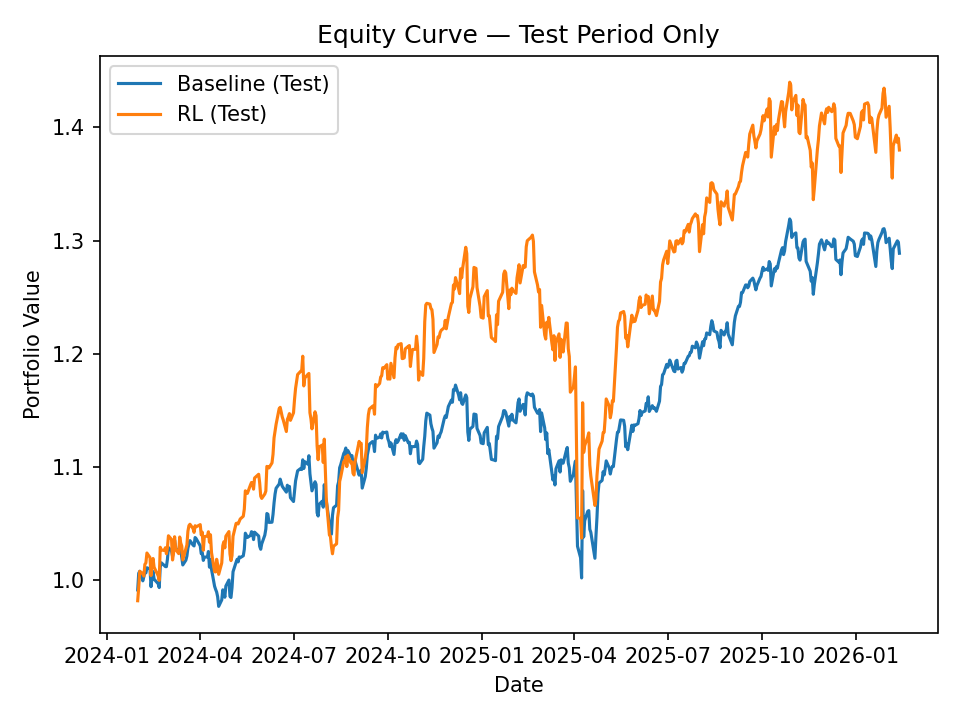

# 📈 RL Portfolio Allocation Agent (PPO)

Projeto end-to-end de Reinforcement Learning para alocação de portfólio usando dados históricos (SPY, QQQ, TLT).
Compara um baseline equal-weight contra um agente PPO treinado para escolher pesos dinamicamente.

---

## 🎯 Objetivo
Treinar um agente de RL (PPO) para decidir pesos de portfólio e comparar performance com um baseline clássico (1/3 em cada ativo).

---

## 🧠 Metodologia (MVP)

Baseline:
Equal-weight (1/3, 1/3, 1/3)

RL Agent (PPO):
- Observação: janela de retornos passados
- Ação: pesos do portfólio (normalizados para somar 1)
- Recompensa: retorno do dia seguinte do portfólio

---

## 📊 Resultados (Local MVP)

Sharpe (Baseline): 0.719  
Sharpe (RL): 0.977  

Max Drawdown (Baseline): -30.06%  
Max Drawdown (RL): -28.18%

---

## 📈 Equity Curve (Baseline vs RL)


---

## 📁 Estrutura do repositório

```
rl-llm-portfolio-agent/
  README.md
  requirements.txt
  notebooks/
    01_mvp_local.ipynb
  src/
    data.py
    env_portfolio.py
    train_rl.py
    evaluate.py
    plots.py
  reports/
    REPORT.md
    figures/
      normalized_prices.png
      equity_curve_baseline.png
      equity_curve_baseline_vs_rl.png
  docs/
    architecture.mmd
```

---

## ▶️ Como rodar

Criar ambiente virtual:

python -m venv venv
venv\Scripts\activate
pip install -r requirements.txt

Treinar modelo:

python -m src.train_rl

Avaliar modelo:

python -m src.evaluate

Gerar gráficos:

python -m src.plots

---

## 📊 Out-of-Sample Test Results

Train period: 2020–2023  
Test period: 2024–2026  

| Metric | Baseline | RL Agent |
|--------|----------|----------|
| Sharpe | 1.03 | 0.927 |
| Max Drawdown | -14.5% | -20.5% |

### 📈 Equity Curve — Test Period Only




The RL agent underperformed the baseline out-of-sample, suggesting possible overfitting and the need for improved reward design.


